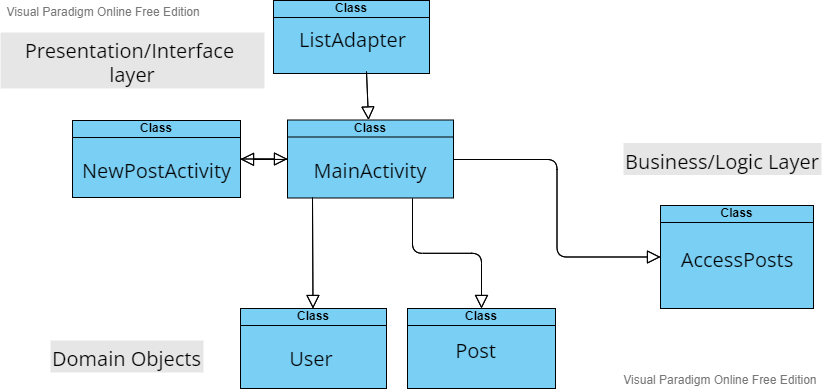

# **Multitier architecture** 

#### Diagram: Iteration 1 

## **Presentation/Interface Layer**

##### MainActivity: 

The main page of the application which containslist of the posts.

##### NewPostActivity: 

The new post activity will let user allows the add their post.

##### ListAdapter: 

This class is for maintining the list items.

## **Business/Logic Layer**

##### AccessPosts: 

The hard coded data about the posts are in this class and it will be accessed in main activity.

## **Domain Objects**

##### Posts:

The class is for object of post, it will be needed when adding a post in the list.

##### User: 

The class is User object it will be needed while saving a user in the database.
