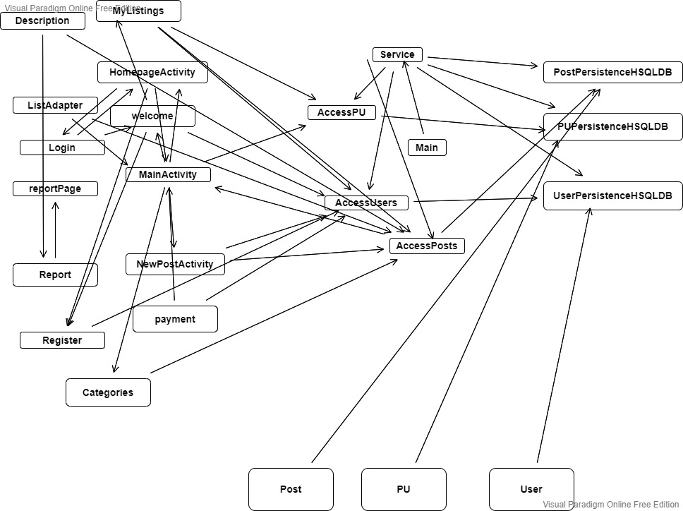

# **Multitier architecture** 

#### Diagram: Iteration 1 

## **Presentation/Interface Layer**

##### MainActivity: 

The main page of the application which containslist of the posts.

##### NewPostActivity: 

The new post activity will let user allows the add their post.

##### ListAdapter: 

This class is for maintining the list items.

##### Welcome: 

After the user registers and login this page gets displayed as a profile for user to navigate. 

##### Register:

The sign up page 

##### Login: 

The Login page for User

##### HomepageActivity: 

All in one place view for our application where all the conection to the pages is 

##### Categories: 

This class where user can find the posts according to their cagegories, it is kind of like advance search feature.

##### Description: 

## **Business/Logic Layer**

##### AccessPosts: 

From this class the access of the database is done, this will access the Post object data from the database

##### AccessPU: 

From this class the access of the database is done, this will access the PU object data from  the database

##### AccessUsers: 

From this class the access of the database is done, this will access the User object data from the database

##### Main: 

This class gives the database path name to all other classes. 

##### Services: 

This class gets the persicatnce of the objects.

## **Persistence**

##### PostPersistenceHSQLDB

This class implements the interface of the PostPersistence and connects to the database

##### PUPersistenceHSQLDB

This class implements the interface of the PUPersistence and connects to the database

##### UserPersistenceHSQLDB

This class implements the interface of the UserPersistence and connects to the database

## **Domain Objects**

##### Posts:

The class is for object of post, it will be needed when adding a post in the list.

##### User: 

The class is User object it will be needed while saving a user in the database.

##### PU

This class is a PostUser object it deals with pirticular user and their posts. this will be in iteration 3
