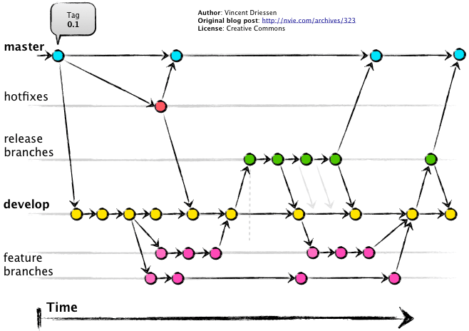

# Vision Statement 🧿

  
## Summary  📝

**Fair Price** is an application that will be used for the basic purpose of buying and selling goods. The application is available throughout the nation, and people will be able to see products by using a **Location** filter. In the application, users as sellers will be able to post an advertisement of a product, accompanying the price, images, description, offer price by the seller, general chat area, for that particular item.

## Audience 👨‍👩‍👧‍👦

The application is designed for those wanting to buy or sell items which are listed on the platform, the item can be either used or a new one. Sellers can advertise their items, and connect with those who are interested in buying them. Buyers can browse the posts in their area (city), and reach out to the seller through the app using a general chat feature.

## Description 📜

The application will include a collection of items, for instance, all the <i>products will be organized based on the **location** 📍</i> (alphabetical order within), **description** and **category** (there will be different options for the **type** of product, such as furniture, electronics, home appliances etc. then after specifying it they can see all the products related to that category). The restriction will be that users must have an account in order to be able to bid on the price offered by the seller, and only **Registered users 👤** will be able to participate in **General chat 💬**.


## Value 💎

**Why we are different from our competitor ?**

The app solves the need of allowing people to sell off their used items. The Fair Price system will give the user the best price they can get for their product by the help of **BIDS** feature. There are two available options for the seller:

1. Allow buyers to bid on the base price
2. No auction, buyers can directly negotiate with the seller

While browsing items on the app, users can **Save 💼** any item they find interesting and can look back on it later in the **Favorites 💙** section. For every post there will be a **General chat 💬** area where people can chat about the product.

**Through this application buyers and sellers will be able to get the best price ＄ for their item.**

## Success Criteria 📈

The application’s success will ultimately be measured by the customer acquisition. The second metric will be the number of goods sold throughout the platform. The earnings will be mostly from the spread ≏ , and the promotions 🔝.

 Accompanying will be the revenue generated by the products sold, which is a direct consequence of the cumulative spread on all the items. Another metric would be the number of users promoting their product, times the average number of products advertised by each individual (account), times the number of days it was being advertised for (each day there is a fixed price, referred to as fees per hundred views for listing).

## Branching Strategy 🌳

Strategy Used:    **Git-Flow**
 
 Install Git-flow:
```
brew install git-flow
```

### Branches

1. Main/Master - Iterations [0, 1, 2, 3]
2. Develop - Iterations + Features

 [1.1 means 1st iteration and 1st feature is completed, 2.3 is 2nd iteration's 3rd feature is completed] 

4. Feature - feature_featureName
5. Release - test case development and other documentation creation branch
6. Hotfix - bug fix branch


### Branch Description 🪵

#### 1. Main/Master 🟥
 Stores the official release history. Tag all commits to this branch with a version number. This branch contains the **main** (or completed) versions of the project

#### 2. Develop ⚙️

Integration branch for features. Contains complete history of the project. It includes **all** the versions of main/master branch and some additional versions (integrated from feature branches).

Create a develop branch by entering in terminal:

```
git branch develop
git push -u origin develop
```
  
To add develop branch **and** all other branches:
```
git-flow init
```
  
#### 3. Feature 💡
Every unique feature should have its own separate branch. This means that if there are 5 features in the project, it will have 5 feature branches. Feature branches use develop as their parent branch. Meaning, one has to create a feature branch, taking the version from the develop branch, make changes while being in the feature branch, then once complete, **it is merged back to the develop branch.** Usually, feature branches are created taking the most recent versions of the project present on develop branch.

Flow:
```
develop ---> feature_NewPost ---> develop
```
  
  


Once the team member completes the feature development on the feature branch, he should transfer back into develop branch, then merge the feature branch to it. This is done by the following steps:

```
git checkout develop  
git merge feature_NewPost
```
OR
```
git flow feature finish feature_NewPost
```
  
#### 4. Release 🏹

Once an iteration is completed, i.e. once all the features required for an iteration have been completed and merged back into the develop branch, you **fork** a release branch from develop branch. That means, a copy of project's latest version is taken from the develop branch, and is added to a new branch called release branch. After this point, no new features are added for that iteration. In this branch, all the **bug fixes, documentation generation, release-oriented tasks, potential test cases for the iteration are executed**. Once that is done, then the completed version present on release branch is merged (with appropriate version number) into two branches: main/master and develop.
      
This enables team members to work on bug fixes on release branch, while others work on next iteration features on develop/features branch. It is possible for versions on develop branch to be out of order.

A new release branch can be created using the commands:

```
git checkout develop  
git checkout -b release/0.1.3
```

OR

```
git flow release start  0.1.3  
```

This means Iteration 1 has only 3 features in total. Next stage will be working on 2.1 (iteration 2 feature 1) on develop branch. 


After all the testing/bug fixes are done on release branch, **the completed version is merged into main/master and develop branches**. Release branch will be deleted. 

> Code review can be done at this point using a pull request

Finish a release branch by commands:

```
git checkout main  
git merge release/0.2.4
```
OR
```
git flow release finish '0.2.4'
```

> 0.2.4  --->  iteration 2 feature 4 has been completed. That is, Full completion of iteration 2 has been merged back into main and develop branch. 


#### 5. Hotfix 🔥

This branch is simply a maintainance branch. Similar to release branch, but it is forked from **main** branch. 
This branch is a **bug fixes** branch, and only used when an error is found on the main/master branch version. User forks off that version from main into the hotfix branch, fixes the bug, and merges the resolved version to **main AND develop** branch (with updated version number).

A hotfix branch can be created using the commands:

```
git checkout main  
git checkout -b hotfix_branch
```
OR
```
git flow hotfix start hotfix_branch
```
<br>
After the previous commands are executed, merging can be done by:

``` 
git checkout main  
git merge hotfix_branch  
git checkout develop  
git merge hotfix_branch  
git branch -D hotfix_branch
```
OR
```
git flow hotfix finish hotfix_branch
```
  


<hr/>

#### References  

[Atlassian - Gitflow Workflow](https://www.atlassian.com/git/tutorials/comparing-workflows/gitflow-workflow)

[A successful git branching model](https://nvie.com/posts/a-successful-git-branching-model/)

[githubschool - Thirty minutes to merge](https://github.com/githubschool/thirty-minutes-to-merge)

[Github - Basic writing and formatting syntax](https://docs.github.com/en/get-started/writing-on-github/getting-started-with-writing-and-formatting-on-github/basic-writing-and-formatting-syntax)


<hr/>

# Thank You.


<br>

### Some additional gitflow pictures for reference



