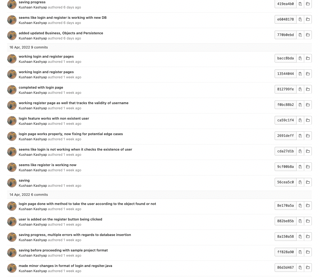
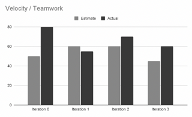

### What technical debt has been cleaned up
========================================

From Iteration 2, we have cleaned up planned technical debt which is deliberate and prudent technical debt. We had to meet Iteration 2 deadline and left out the user registration part for iteration 3 and made sure that a model for register and login page. In this iteration 3, we have allowed a user to add his account using the Register page so as to log the user into the app with the login page using the right format including proper logic checks. 

### Show links to a commit where you paid off technical debt. Write 2-5 sentences that explain what debt was paid, and what its classification is.

  

In this we see that in feature_Register branch on gitlab, work was being done to make Login and Register activities functional with any update to be recorded in the database and make the whole application dynamic. 

### What technical debt did you leave?
==================================

We left out the bidding part for the application. This might have allowed a user to place bids on the products listed and the product would be sold to the person who placed the highest bid as compared to all others, like an auction system. 
Instead of that, we simply added the payment button that takes the user to “add payment details” activity so as to make it a direct checkout. This technical debt we left is classified as reckless and prudent.

### What one item would you like to fix, and can't? Anything you write will not be marked negatively. Classify this debt.

We would like to fix the design aspect for the description page since we were unable to make it according to the flexible layout and it becomes too crowded as the emulator’s screen size changes. We classify this as reckless and prudent.

### Discuss a Feature or User Story that was cut/re-prioritized
============================================

In addition to the bidding feature, we left out the feature where users will be able to chat to other users in the application under a product’s description page. We did not have enough time to implement it along with other features with proper functionality so we decided to focus and prioritize other features and user stories.

### When did you change the priority of a Feature or User Story? Why was it re-prioritized? Provide a link to the Feature or User Story. This can be from any Iteration.

We changed the priority of a feature in iteration 2 as we got the idea there will be too much to handle if we implement the chat feature. Instead, we added the category feature and enhanced it so as to make it more attractive for our overall application’s design improvement. We thought it would be better to add something more graphic rather than a chat as it would require a multi-user input that would not be as beneficial since the user can directly provide his contact details in description of the product. 

https://code.cs.umanitoba.ca/winter-2022-a01/group-8/fair-price/-/blob/feature_DummyPayment/app/src/main/res/layout/activity_categories.xml

### Acceptance test/end-to-end

### Write a discussion about an end-to-end test that you wrote. What did you test, how did you set up the test so it was not flaky? Provide a link to that test.

A test that we wrote was creating a new user post.The setup for the test was not that hard as we took help from the sample project as a reference. Then we used “Record Espresso test” to make our tests and it was easy. There were errors after the system creates the test but we solved it.Then before we had com.Android.Support and Androidx commands in build.gradel  file in dependencies so the tests were not working, so we had to keep one from them to make the test work and we did it with androidx. We had to delete the user before the test was run each time in order not to get an error.
app/src/androidTest/java/comp3350/fairprice/presentation/CreateAccountTest.java · main · winter-2022-A01 / Group 8 / Fair Price · GitLab (umanitoba.ca)

## Acceptance test, untestable

### What challenges did you face when creating acceptance tests? What was difficult or impossible to test?

The difficult part was scrolling, pannal click, and few other things which like effects as they do not have any id it is really hard to test those kinds of effects. The pop up panel was giving an error but we solved it but the scrolling and effects were impossible to test. 

Note : Our All test is not working so the professor told us that to mention markers, that our individual tests are working.  

## Velocity/teamwork

### Did your estimates get better or worse through the course? Show some evidence of the estimates/actuals from tasks.

Our estimates got better with the progress throughout the course. However, since our estimates got better, we became a bit over-confident on what we could achieve and the extend of our ability to implement feature with great quality. That allowed us to implement the features much better but it resulted in keeping our estimates a bit off track as well as we spent more time perfecting everything and that consumed a lot of time, but as compared to our previous iteration in which most of time was spent trying to figure out basic stuff to make simple buttons work, and in later iteration that same time was spent in perfecting each feature.

